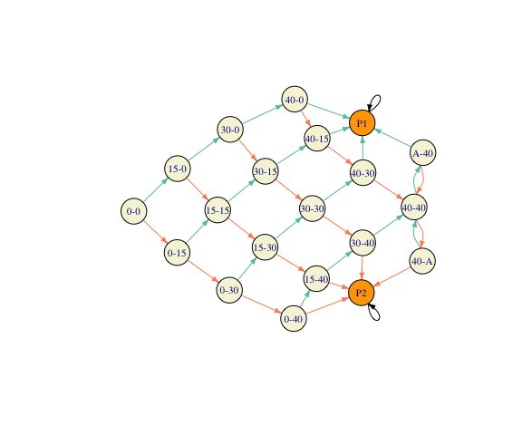

<!-- README.md is generated from README.Rmd. Please edit that file -->

# chapman

<!-- badges: start -->

<!-- badges: end -->

*chapman-r* is an R package for creation, visualization and manipulation of Markov chains. 

## Installation

You can install the released version of chapman from
[CRAN](https://CRAN.R-project.org) with:

``` r
install.packages("chapman")
```

And the development version from [GitHub](https://github.com/) with:

``` r
# install.packages("devtools")
devtools::install_github("gordanz/chapman-r")
```

## Example

``` r
library(chapman)
## basic example code
m = tennis()
plot(m, vertex.size=40)
```


